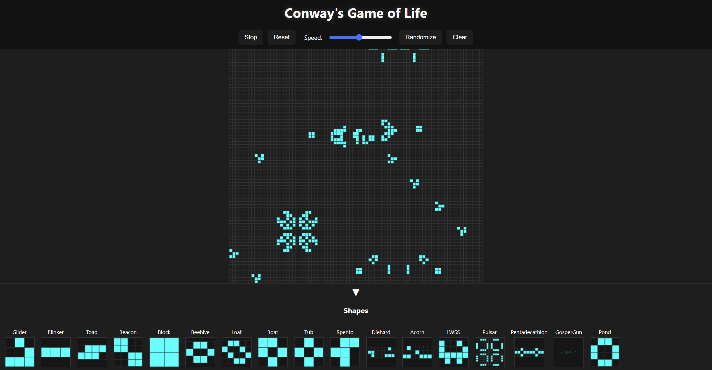
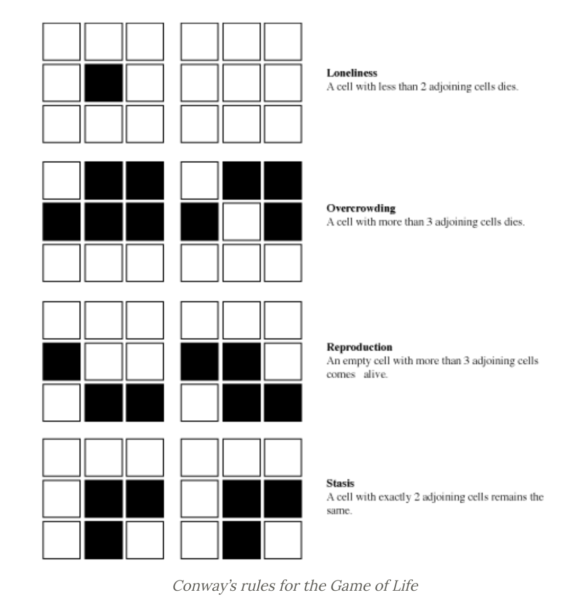

# Conway's Game of Life (Mobile Optimized)

A responsive, mobile-friendly implementation of Conway’s Game of Life using vanilla JavaScript, HTML, and CSS.

## Live Demo

[Try it online](https://shahryarfp.github.io/Game-Of-Life/)

## Features

- Drag to pan and pinch/scroll to zoom
- Place predefined shapes (Glider, Blinker, Beacon, etc.)
- Start/Stop, Reset, Randomize, and Clear controls
- Adjustable speed slider

---

## What Is Conway’s Game of Life?

Conway’s Game of Life (often just called “Game of Life”) is a zero-player cellular automaton devised by mathematician John Horton Conway in 1970. It takes place on an infinite two-dimensional grid of square cells. Each cell can be in one of two states:

- **Alive** (usually shown as a filled or colored square)  
- **Dead** (an empty or blank square)

Time advances in discrete steps, called “generations.” At each generation, the state of every cell is updated simultaneously based on a simple set of rules. Despite the simplicity of these rules, the system can exhibit surprisingly complex and often beautiful behavior.

---

## How It Works

1. **Initial Configuration**  
   You start by “seeding” the grid with an initial pattern of live cells (sometimes referred to as “seeds” or “organisms”). This initial pattern can be anything—random noise, a classic shape like a Glider or a Gosper Glider Gun, or one of the predefined shapes provided in this implementation.

2. **Neighbors**  
   Each cell interacts only with its eight immediate neighbors: the cells that are horizontally, vertically, or diagonally adjacent. In other words, for any given cell, you look at the cells directly above, below, left, right, and the four diagonal positions around it.

3. **The Four Simple Rules**  
   At each generation, all cells update their state simultaneously according to these rules:

   - **Underpopulation**:  
     Any live cell with fewer than two live neighbors dies (becomes a dead cell) in the next generation, because it is considered “underpopulated.”

   - **Survival**:  
     Any live cell with two or three live neighbors remains alive in the next generation.

   - **Overpopulation**:  
     Any live cell with more than three live neighbors dies (becomes a dead cell) in the next generation, because it is considered “overcrowded.”

   - **Reproduction**:  
     Any dead cell with exactly three live neighbors becomes a live cell in the next generation, as if by reproduction.

   These rules are applied to every cell on the grid at the same time to produce the next generation.

4. **Evolution Over Time**  
   Because every cell’s fate depends on its neighbors, complex patterns can emerge: some patterns disappear quickly, some oscillate between a small set of configurations (oscillators), some travel across the grid (spaceships), and some even grow indefinitely. The Game of Life is famous for demonstrating how simple, local interactions can give rise to extremely rich, emergent behavior.

---

## Simple Examples of Patterns

- **Still Lifes**: Patterns that do not change from one generation to the next (e.g., Block, Beehive).
- **Oscillators**: Patterns that return to their initial state after a fixed number of generations (e.g., Blinker, Toad).
- **Spaceships**: Patterns that move across the grid over successive generations (e.g., Glider, Lightweight Spaceship).
- **Guns and Puffers**: Larger constructions that periodically emit smaller moving patterns (e.g., Gosper Glider Gun).

Feel free to experiment by placing one of the predefined shapes or drawing your own custom configuration. Watch how it evolves and interacts with other cells as generations progress!
